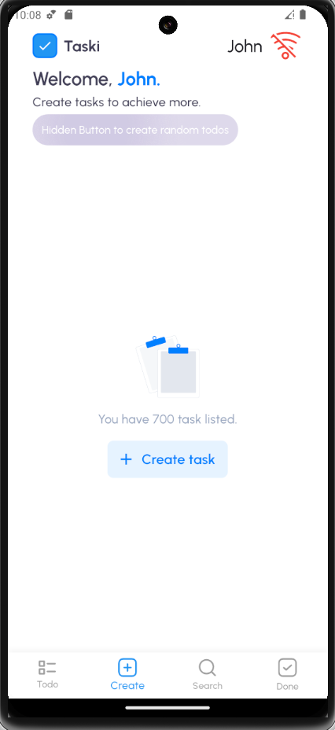

# **Todo List**

## **Overview**
A simple and structured Todo List application built with **Flutter**, following the principles of **Clean Architecture**.

---

## **Features**
- Add, update, and delete tasks.
- Mark tasks as completed or pending.
- Clear separation of concerns using Clean Architecture principles.
- Fully tested with unit tests.
- A hidden button is available to create todos for testing purposes.



---

## **Getting Started**

### **Prerequisites**
Before you begin, ensure you have the following installed:
- [Flutter](https://flutter.dev/docs/get-started/install) (latest stable version)
- An Android or iOS emulator, or a physical device for testing.

---

### **Clone the Repository**
To clone and set up the project, run the following commands in your terminal:

```
git clone https://github.com/TiagoLustosa/todo_clean_arch
cd todo_clean_arch
flutter pub get
```

### **Running the project**
1. Start your android or iOS emulator:

```
flutter run
```

### **On a Physical Device**
1. Connect your device to your computer.
2. Ensure USB debbuging is enabled.
3. Run the project
```
flutter run
```

### **Testing**
To check if the application passes all unit tests:
```
flutter test
```